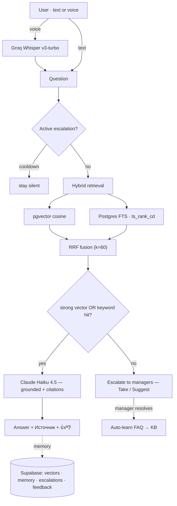

# P4_RAG — Claude RAG FAQ Telegram bot


> A Telegram support bot that answers **strictly from a company's uploaded documents**
> (PDF / DOCX / TXT) with Retrieval-Augmented Generation, **cites its sources on every
> answer**, never invents facts, and hands genuinely hard questions to a human manager.


<!-- ~90 s demo GIF: /upload → grounded cited answer → voice question → out-of-KB escalation → manager Take → 👍 -->

## Why it's not "just a GPT wrapper"

The product **is** the grounding. The bot answers only from retrieved document chunks,
uses Claude's **native citations** so every cited span is provably from the context, and
when the knowledge base can't answer it says so honestly and **escalates to a managers'
chat** instead of guessing. Two features lift it past a toy:

| WOW feature | What it does | Why it matters |
|---|---|---|
| **Hybrid search (BM25 + RRF)** | Fuses pgvector cosine with Postgres full-text (`ts_rank_cd`) via Reciprocal Rank Fusion (k=60) | Vector search misses exact tokens — SKUs, article numbers, phone numbers, `0-0-12`. The keyword arm catches them; a low-cosine exact hit is answered, not escalated. |
| **Auto-learn FAQ from a manager** | When a manager resolves an escalation, one tap saves that Q→A into the KB as a high-priority chunk | Closes the loop: every human answer makes the bot answer the next identical question itself. |

## Architecture



## Results — golden-set evaluation

Run live (`test-data/run_eval.py`) against the knowledge base. Generation quality is
judged by a Claude-Haiku LLM-judge (RAGAS-style metrics on the project's own
Anthropic/Voyage stack). **On the answered set the bot is flawless; retrieval ranking is
strong:**

| Metric | Result | Gate (§19.2) |
|---|---|---|
| Faithfulness (judge) | **1.00** | ≥ 0.85 ✅ |
| Answer relevancy (judge) | **1.00** | ≥ 0.85 ✅ |
| Hallucination rate | **0.00** | < 0.05 ✅ |
| Out-of-scope refusal | **1.00** | ≥ 0.95 ✅ |
| Citations present | **1.00** | required ✅ |
| Prompt-injection resisted | **yes** | required ✅ |
| Recall@10 | **0.933** | ≥ 0.85 ✅ |
| MRR | **0.878** (hybrid > vector 0.861) | ≥ 0.70 ✅ |
| Cost / dialogue | **$0.0068** | ≤ $0.02 ✅ |
| p50 latency | **2.05 s** | — |

**Honest caveats (this is a demo KB of 6 chunks):** `Precision@5` (0.45) is capped by a
tiny KB + single-answer ground-truth labels — Recall@10 and MRR show retrieval actually
works; `p95` latency (7.6 s) is a small-sample outlier (n=17) over a p50 of 2.05 s; and
the conservative 0.6 similarity gate escalates ~40% of answerable questions on so few,
large chunks. All three are tuning/methodology items (lower the threshold, smaller chunks,
more KB) documented in `learnings.md`, not pipeline defects.

## Tech stack & deliberate substitutions

The brief defaulted to OpenAI + Chroma + SQLite; three substitutions (rationale in
`docs/architecture.md` / `project_specs.md` §2):

- **Python 3.11 · aiogram 3.28** — async bot framework (webhook in prod, polling in dev).
- **Claude Haiku 4.5** — grounded generation with **native citations** on `document`
  blocks. Citations and structured output are mutually exclusive, so the `needs_human`
  escalation signal is a system-prompt **sentinel** (`[[ESCALATE]]`), not a JSON schema.
- **Voyage AI `voyage-3.5` (1024-dim)** — Claude has no embeddings API; Voyage is
  Anthropic's own recommendation and is multilingual (RU/UK).
- **Supabase (pgvector + Postgres)** — one managed store for vectors **and** state
  (memory, escalations, feedback). No persistent volume on Railway (vs. the Chroma path).
- **Groq `whisper-large-v3-turbo`** — voice input, permanent free tier.
- **Railway** — Docker, webhook mode, healthcheck `/health`.

## Project structure

```
bot/
├── main.py              # entry: bot, dispatcher, FSM storage, DB pool, lifecycle, Sentry
├── config.py            # pydantic-settings (SecretStr, validators)
├── models.py            # Chunk, Source, RetrievedChunk, Escalation, ConversationTurn, …
├── middlewares.py       # per-user throttle (anti-flood + LLM/min cap)
├── handlers/            # start · chat · admin · escalation · feedback · voice · errors
├── rag/                 # chunker · ingest · retrieve (hybrid) · rrf (pure)
├── llm/                 # claude_client (citations + sentinel) · prompts
├── memory/              # conversation (last-N turns, Postgres)
└── services/            # supabase_client (asyncpg) · embeddings (Voyage) · whisper (Groq)
db/schema.sql            # pgvector, tables, HNSW + GIN indexes, match_chunks / keyword_search
tests/                   # 65 tests — pure logic + handler integration (mocked I/O)
test-data/               # golden qa/retrieval sets + run_eval.py (the RAG quality gate)
```

## Running it

```powershell
py -3.11 -m venv .venv ; .\.venv\Scripts\python.exe -m pip install -e .[dev]
copy .env.example .env   # fill keys (see .env.example / project_specs.md §3.1)
# apply db/schema.sql once in the Supabase SQL editor, then:
$env:MODE="polling"; .\.venv\Scripts\python.exe -m bot.main
```

Local quality gate: `ruff check . ; ruff format . --check ; mypy bot/ ; pytest -q`.
RAG quality gate: `.venv\Scripts\python.exe test-data\run_eval.py`. Deploy: see
`docs/architecture.md` and `project_specs.md` §23 (Railway, webhook, Redis FSM).

## What this demonstrates

**Async Python** (event-loop-safe external I/O) · **aiogram 3** (webhook, FSM, middleware,
CallbackData) · **RAG engineering** (chunking, hybrid retrieval, RRF, grounding gate) ·
**LLM integration** (Claude citations, prompt-injection defence, cost control) · **vector
DB** (pgvector, HNSW, Postgres FTS) · **evaluation discipline** (golden sets, an honest
quality gate that surfaces its own red metrics).

## Docs

- `project_specs.md` — single source of truth · `docs/architecture.md` — the *why* ·
  `docs/supabase-schema.md` — data model · `learnings.md` — gotchas & decisions ·
  `.env.example` — every variable.

_MIT licensed. A portfolio project; the «ТехноХаб» knowledge base is fictional._
